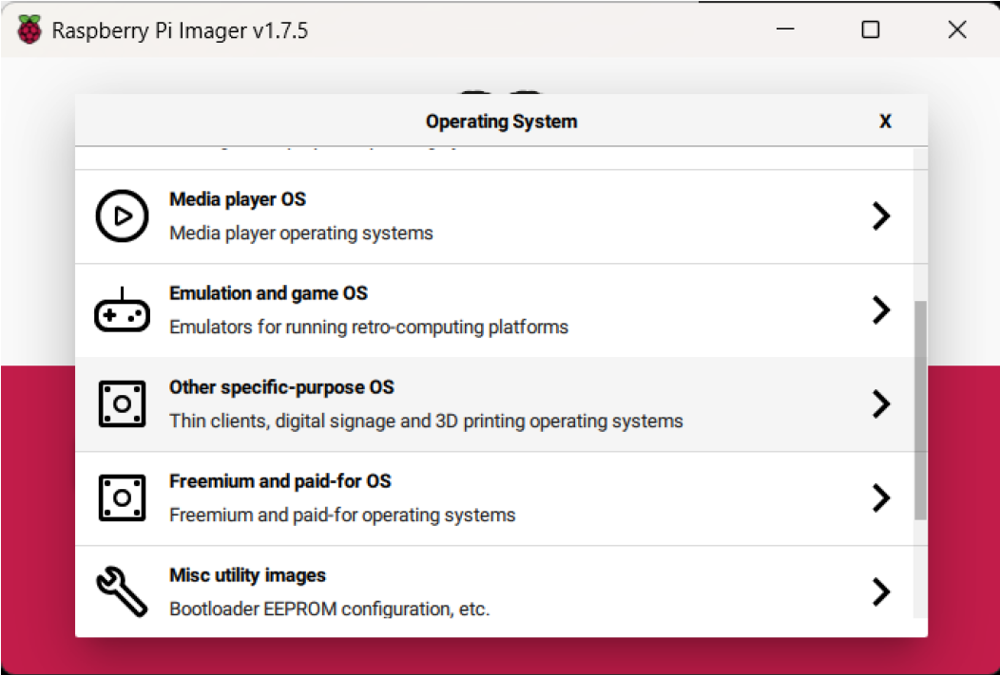
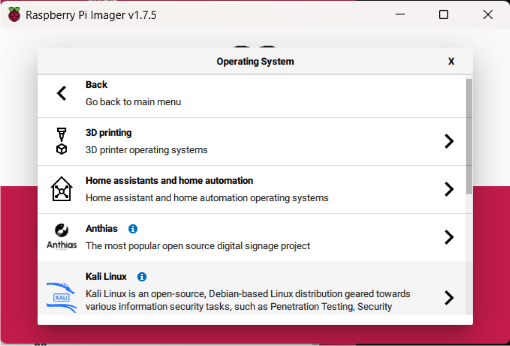
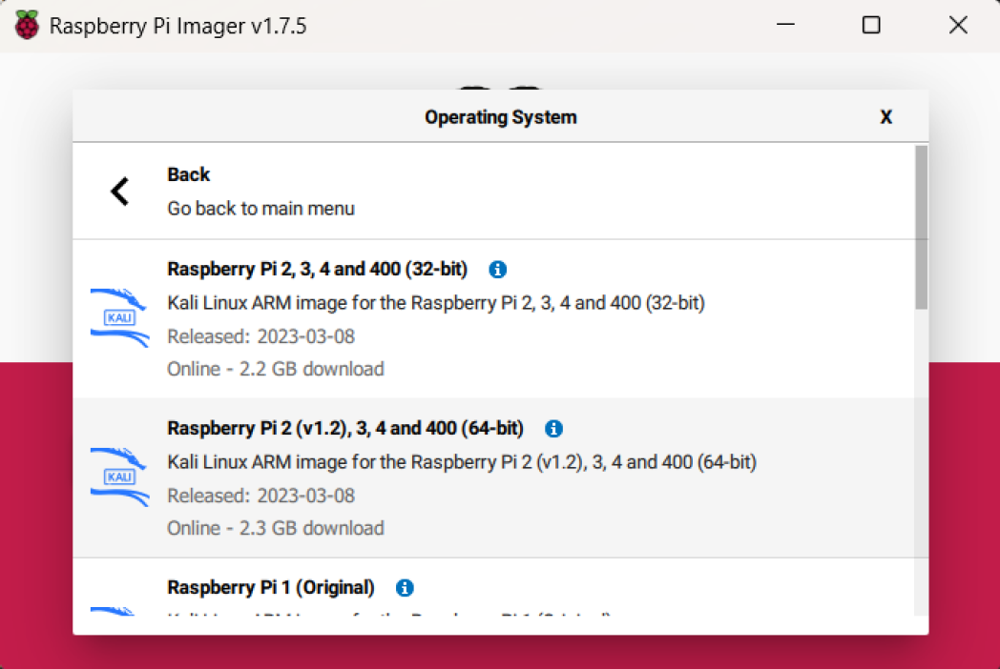
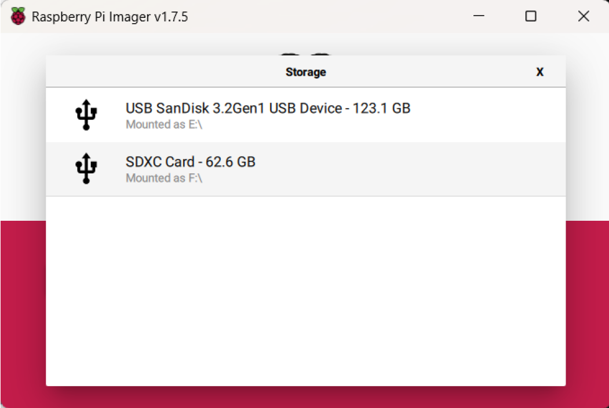
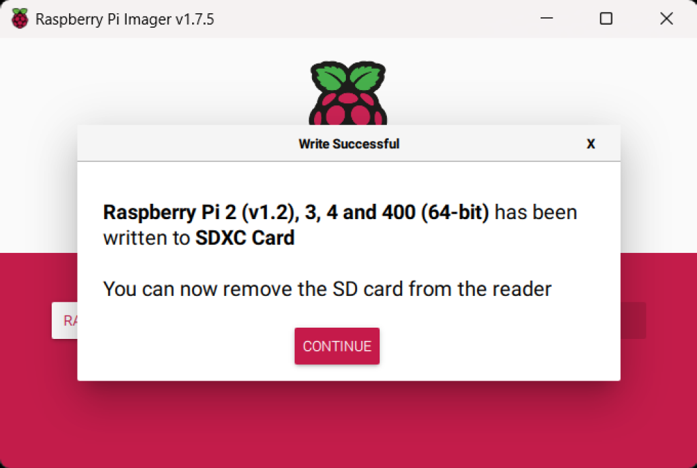

Existen varios métodos para realizar la instalación del Sistema Operativo (SO) Kali Linux en la
Raspberry Pi pero en este caso se hará uso de la herramienta *Raspberry Pi Imager*, descargada
de la [web oficial de Raspberry Pi](https://www.raspberrypi.com/software/). Una vez instalada, será necesario disponer de una tarjeta de
memoria micro SD con una capacidad recomendada de al menos 16 GB, donde se instalará el SO
y servirá de almacenamiento.

Así, una vez instalada la herramienta, al iniciarla se encuentra un simple menú como el que
muestra la siguiente Figura:

Eligiendo la opción "*Choose OS*", será necesario especificar la distribución a instalar, en este
caso, debermos elegir "*Other specific-purpose OS*", "*Kali Linux 2 "Raspberry Pi 2 (v1.2), 3, 4 and
400 (64 bit)*". Tal y como refleja la siguiente secuencia de Figuras:

De vuelta en el menú inicial, eligiendo la opción "*Choose Storage*", se elige el dispositivo de almacenamiento donde se instalará el SO.

Por ultimo, activa la opción "*Write*" se podrá proceder a escribir la imagen en la tarjeta micro
SD, recibiendo el mensaje de confirmación que aparece en la siguiente Figura:

Realizados estos sencillos pasos, será posible conectar la Raspberry Pi a un monitor y encenderla
para poder comprobar que el proceso se ha realizado correctamente.

Además del método seguido en esta guía de instalación, es posible descargar una imagen oficial
de Kali y utilizar alguna herramienta externa, como "*dd*" para pegar la imagen en la memoria micro
SD. Además, también existe la posibilidad de generar imágenes personalizadas en las que incluir
cambios de paquetes instalados, configuraciones y otros ajustes, para obtener una imagen a gusto
personal, pero en este caso, no se profundizará en estas opciones, aunque tiene cabida mencionar
y conocerlo.