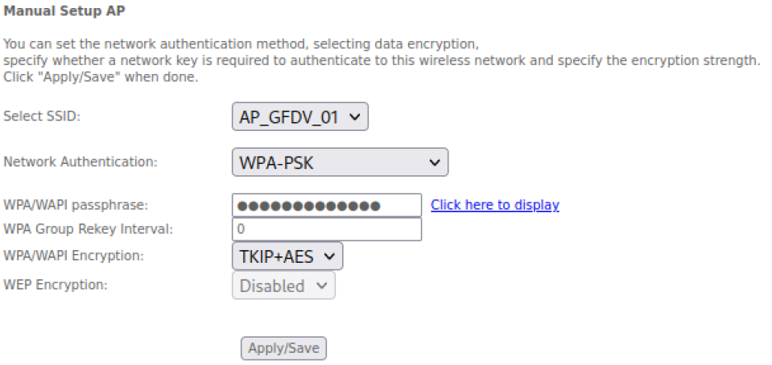

# Ataques realizados en el desarrollo del proyecto

El menú principal de Airgeddon muestra el siguiente contenido:

## Denegación de servicio (DoS)

La primera opción del apartado de ataques del menú de airgeddon es la de ataques DoS, que buscan dejar sin acceso a la red a usuarios legítimos inutilizando la red con una inundación de paquetes contra el punto de acceso e incluso contra los mismos clientes conectados, tal y como muestra el siguiente diagrama:

Así, seleccionando la opción correspondiente, se encuentra un nuevo menú donde se pueden diferenciar dos claros apartados, con ataques para los que es necesario utilizar el modo monitor de la interfaz de red, y ataques antiguos obsoletos o útiles. Estos últimos (basados en inundar al cliente con múltiples puntos de acceso con un mismo nombre, en generar falsas autenticaciones al AP o en un ataque contra WEP) no son muy eficaces contra los protocolos más recientes, por lo que el ataque será orientado a las tres primeras opciones.

Las tres mencionadas opciones o técnicas en uso, pueden utilizarse (como es este caso) para realizar un ataque DoS, aunque más adelante serán usadas junto con otros ataques para realizar
también DoS u otras opciones específicas (como una simple deautenticación momentánea de un cliente), siendo el más común, el ataque de deautenticación realizado por la herramienta *aireplay-ng* en la que se envían múltiples paquetes de deautenticación (tal y como se ve la próxima Figura) dejando totalmente inútil el punto de acceso, para que ni siquiera los clientes puedan reconocerlo a la hora de buscar conexión.

## WPA Pre-Shared Key Cracking

Se trata del clásico ataque a WPA cuyo proceso es posible dividir en varias fases: identificación y escaneo de redes, captura del handshake y descifrado del handshake. En Airgeddon, se utilizarán las opciones 5 y 6 del menú principal. Para completar todo este proceso, se utilizan diferentes técnicas y ataques que permiten vulnerar la seguridad de una red de este tipo.

Además, la configuración del AP se ha modificado para utilizar el protocolo WPA con TKIP, además de haber establecido su contraseña a *neverhacked33*.

### Identificación y escaneo de redes

Desde el menú principal de Airgeddon, se accede a la opción número 5 "*Handshake/PMKID tools
menu*", la cuál mostrará un nuevo menú  donde se eleccionará la opción "*Explore for targets (monitor mode needed)*" que iniciará un escaneo de las redes a las que tiene alcance la tarjeta de red en uso. Así, una ventana emergente aparecerá donde van apareciendo redes e información sobre ellas, entre las que se encuentran el BSSID, el ESSID, la calidad o potencia de señal, el cifrado que utilizan y el canal en el que operan. Una vez identificado el punto de acceso objetivo, (en este caso AP_GFDV_01) se interrumpe la ejecución presionando *Ctrl+C*, dando lugar a una lista de los puntos de acceso encontrados y una entrada a consola para seleccionar el objetivo deseado. Además, esta lista informa de aquellos AP que cuentan con clientes conectados.

### Captura del handshake

Tras identificar el objetivo del ataque, será necesario obtener un handshake válido para proceder a la ruptura del mismo. Esto es posible conseguirlo de dos formas distintas, una lenta, que no asegura ningún tipo de éxito, la cuál consigue en esperar a que un cliente nuevo se conecte a la red o que uno ya conectado se desconecte y se vuelva a conectar, y una forma más eficaz, que consiste en realizar un ataque de deautenticación de manera que se fuerce el handshake. Esta última es la que ejecuta Airgeddon y cuyo proceso se ve reflejado en la siguiente Figura:

Así, seleccionar la opción "*Capture Handshake*" mostrará un nuevo menú con las opciones de deautenticación disponibles. En este caso, se hará uso de la opción "*Deauth aireplay attack*", que utiliza la herramienta *aireplay-ng* de la suite *aircrack-ng*.

Una vez seleccionada la opción de captura permite establecer la duración del ataque en un rango de 10 a 100 segundos, lo cuál debe ser suficiente para realizar la deautenticación de los  ispositivos conectados al AP Iniciado el ataque, aparecen dos ventanas emergentes, una con el proceso de captura de paquetes de la red objetivo y otra con el envío de paquetes de deautenticación.

En la imagen anterior es posible identificar cómo se ha conseguido capturar un handshake
tanto por el mensaje en la primera línea ’*WPA handshake: 38:72:C0:9F:14:00*’, como por la identificación del protocolo Extensible Authentication Protocol over LAN (EAPOL) en los paquetes capturados.

Este proceso, en una ejecución sin este tipo de suites requeriría el uso de comandos algo complejos en los que incluir información del AP objetivo y el uso de varios terminales simultáneos, por lo que se puede observar una gran ventaja en el uso de Airgeddon.

### Descifrado del handshake

El último paso para completar este ataque es el descifrado del handshake capturado, para lo que será necesario seleccionar la opción ’*Offline WPA/WPA2 decrypt menu*’ en el menú principal, lo que da lugar a una pantalla con las diferentes formas de realizar el ataque, entre las que se encuentran distintos variantes de uso de aircrack y hashcat, tanto para handshake como PMKID.

Las posibilidades para romper un handshake en este caso son cinco diferentes, pudiendo atacar
mediante diccionario o por fuerza bruta basada en reglas o generando un diccionario con crunch. Esta última opción únicamente será consultada por la gran cantidad de recursos que supone ejecutarla. Así, eligiendo la opción ’*aircrack Dictionary attack against Handshake/PMKID capture file*’, será necesario especificar la ruta del fichero que contiene el handshake así como del diccionario a utilizar, que para este caso es uno generado a partir de 100.000 líneas del conocido diccionario *rockyou.txt* incluido en Kali Linux que contiene más de 14 millones de contraseñas reales y de donde se ha sacado la contraseña configurada en el AP.

Una vez iniciado el ataque será posible visualizar el proceso de ataque por diccionario, que, en este caso, tarda un tiempo total de 4 minutos y 15 segundos en procesar obtener la contraseña y exportarla a un fichero de texto.

Como alternativa, se ha tratado de romper el mismo handshake por medio del mismo diccionario
pero esta vez utilizando la opción de *hashcat*, la cual es exitosa. Además, cabe mencionar que el tiempo de ejecución ha sido muy similar, aunque *hashcat* permite el uso de GPUs, lo que proporcionaría una mayor rapidez en caso de poder realizar el ataque mediante este hardware.

Por último, como se ha mencionado previamente, eligiendo el ataque de fuerza bruta con *aircrack* y *crunch* se pide especificar un tamaño mínimo de clave y uno máximo (entre 8 y 63), para luego especificar un conjunto de caracteres a utilizar. Eligiendo, por ejemplo, un tamaño de clave de 20 caracteres y un set de mayúsculas y números, se generarían, tal y como muestra a continuación, 2821109907456 combinaciones diferentes y un total de 23 TB de información, lo que supone unos recursos y tiempo mucho mayores de los disponibles.

## WPA2 PMKID

Este ataque, es el más actual contra WPA2 y permite romper la clave sin capturar un handshake completo (tan solo con el primer paquete que incluye el PMKID), y mucho más importante, sin necesidad de una tercer dispositivo cliente al que deautenticar o esperar que se conecte, puesto que será el atacante el que solicite el emparejamiento, lo que supone una gran ventaja frente a otros ataques.

Este ataque cuenta con las mismas fases que la ruptura de handshake previamente realizada, con la diferencia de que esta vez no se capturará un handshake completo, no se realizará un ataque de deautenticación y se hará uso de la herramienta hashcat. Además, para realizarlo, se ha configurado el AP objetivo indicando el uso del protocolo WPA2 con cifrado AES.

### Captura del PMKID

Las acciones previas a la captura del PMKID son idénticas al ataque anterior, por lo que no se verán reflejadas. A partir de ahí, y una vez situados en el menú de captura, se selecciona la opción ’*Capture PMKID*’, que solicitará un valor de timeout de entre 10 y 100 segundos antes de iniciar la captura. Esto arrancará un nuevo terminal que realiza las acciones necesarias para capturar el primer paquete del handshake que será suficiente para intentar averiguar la clave del punto de acceso.

Una vez finalizada la captura, aparece un mensaje informando del éxito o fracaso de la acción, además de facilitar una conversión del fichero de captura para su compatibilidad con aircrack, ya que hashcat utiliza hashes para realizar el ataque y aircrack utiliza un formato de captura de red clásico (’cap' o 'pcap’), pudiendo así evitar la estricta necesidad de utilizar hashcat para la siguiente fase.

### Ataque de diccionario contra PMKID

Situados en el menú principal y seleccionando la opción ’*Offline WPA/WPA2 decrypt menu*’ para avanzar al siguiente menú será posible seleccionar la opción asociada al ataque por diccionario a un fichero con captura de PMKID (aunque existen otras opciones ya comentadas) para posteriormente especificar la ruta del fichero a atacar y el diccionario a utilizar (en este caso el preparado para estas pruebas) y comenzar el ataque de manera automática sin necesidad de conocer los comandos específicos de hashcat.

Así la Figura anterior refleja cómo en algo menos de dos minutos se han procesado las 100.000 líneas del diccionario elegido y se ha hallado la contraseña del AP, que se exporta a un fichero de texto con el resultado. 

De igual manera, si se dispone de la captura de tráfico con el paquete PMKID capturado o se ha utilizado la conversión ofrecida durante el proceso de captura anterior, será posible realizar el ataque mediante aircrack, que en este caso ha ofrecido el resultado en un tiempo mayor al transcurrido con el uso de hashcat.

## Evil Twin

## Ataque a WPS y Pixie Dust

