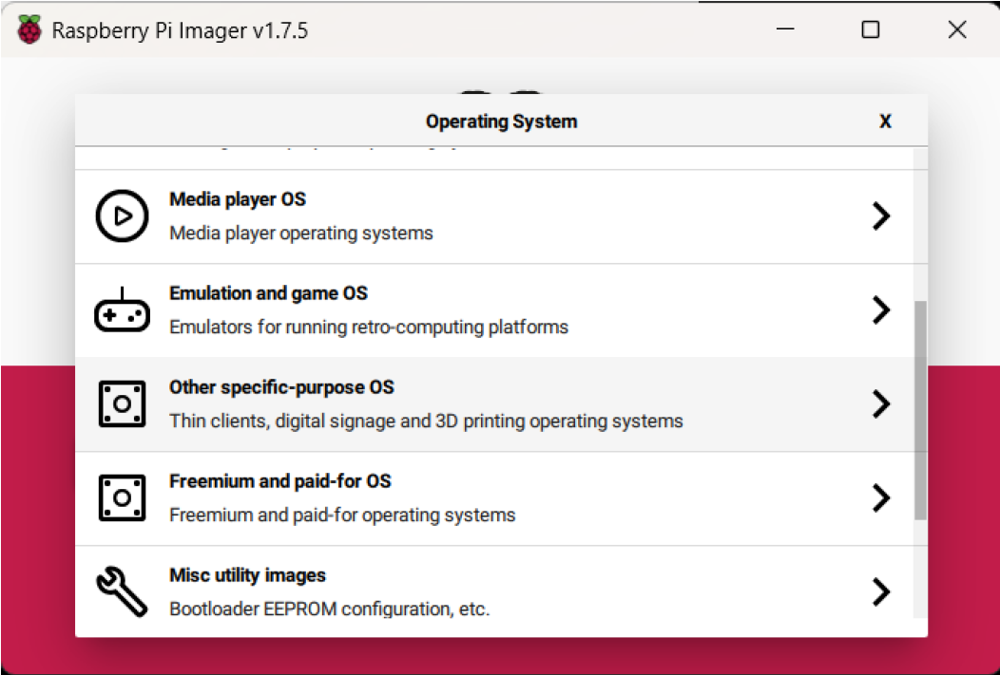
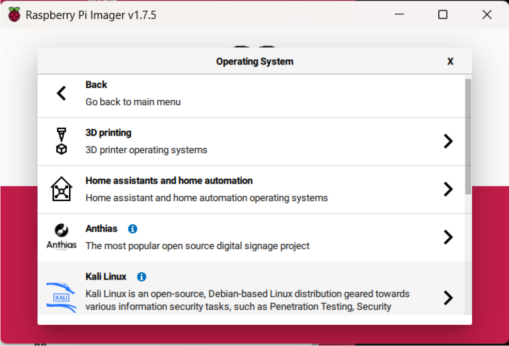
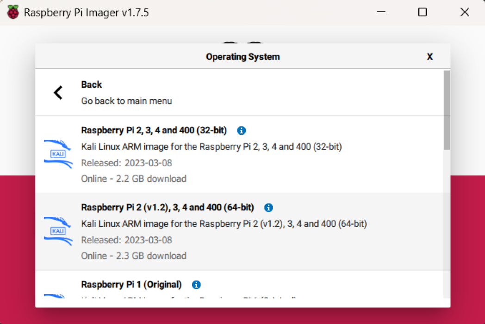
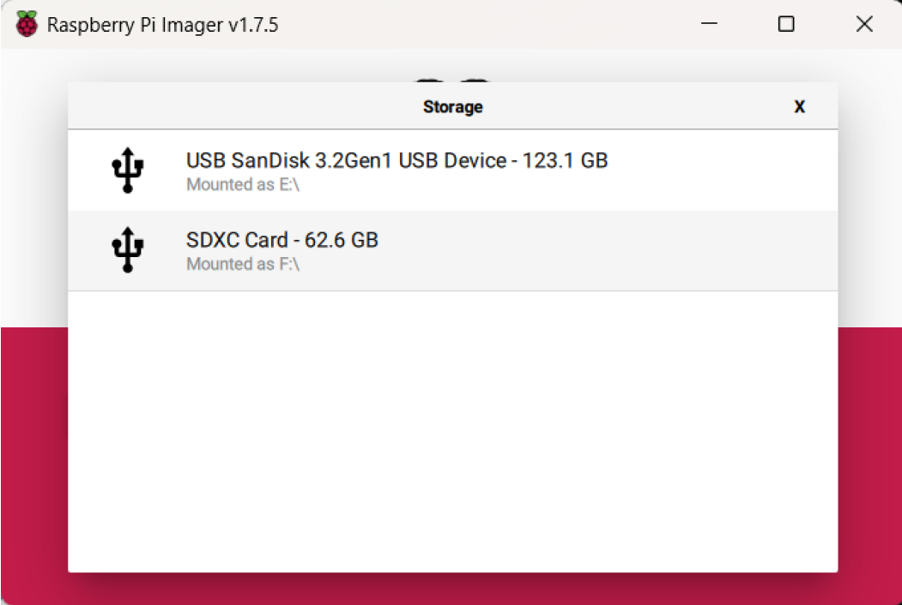

# Instalación de Kali Linux en Raspberry Pi

Existen varios métodos para realizar la instalación del Sistema Operativo (SO) Kali Linux en la
Raspberry Pi pero en este caso se hará uso de la herramienta *Raspberry Pi Imager*, descargada
de la [web oficial de Raspberry Pi](https://www.raspberrypi.com/software/). Una vez instalada, será necesario disponer de una tarjeta de
memoria micro SD con una capacidad recomendada de al menos 16 GB, donde se instalará el SO
y servirá de almacenamiento.

Así, una vez instalada la herramienta, al iniciarla se encuentra un simple menú como el que
muestra la siguiente Figura:

Eligiendo la opción "*Choose OS*", será necesario especificar la distribución a instalar, en este
caso, debermos elegir "*Other specific-purpose OS*", "*Kali Linux 2 "Raspberry Pi 2 (v1.2), 3, 4 and
400 (64 bit)*". Tal y como refleja la siguiente secuencia de Figuras:

De vuelta en el menú inicial, eligiendo la opción "*Choose Storage*", se elige el dispositivo de almacenamiento donde se instalará el SO.

Por ultimo, activa la opción "*Write*" se podrá proceder a escribir la imagen en la tarjeta micro
SD, recibiendo el mensaje de confirmación que aparece en la siguiente Figura:

Realizados estos sencillos pasos, será posible conectar la Raspberry Pi a un monitor y encenderla
para poder comprobar que el proceso se ha realizado correctamente.

Además del método seguido en esta guía de instalación, es posible descargar una imagen oficial
de Kali y utilizar alguna herramienta externa, como "*dd*" para pegar la imagen en la memoria micro
SD. Además, también existe la posibilidad de generar imágenes personalizadas en las que incluir
cambios de paquetes instalados, configuraciones y otros ajustes, para obtener una imagen a gusto
personal, pero en este caso, no se profundizará en estas opciones, aunque tiene cabida mencionar
y conocerlo.